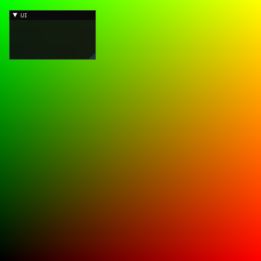
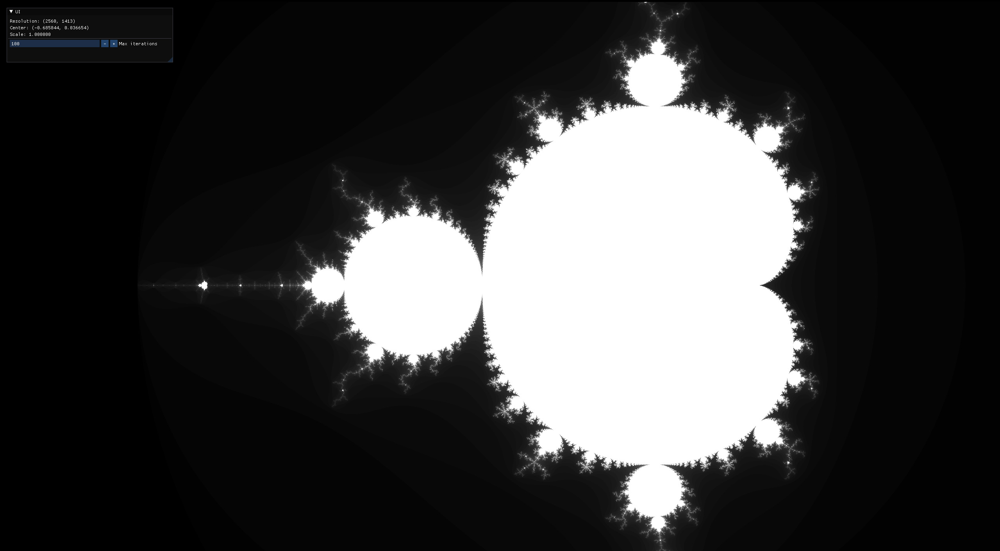

# glsl-compute-shader-sandbox

Some examples of OpenGL compute shader.

## Requirements

* C++ (>=20)
* CMake (>= 3.20)
* OpenGL 4.6

## Build

```
git submodule update --init
mkdir build
cd build
cmake ..
make
```

## Gallery

### hello



### mandelbrot



## Externals

* [glad](https://github.com/Dav1dde/glad)
* [GLFW](https://github.com/glfw/glfw)
* [glm](https://github.com/g-truc/glm)
* [Dear ImGui](https://github.com/ocornut/imgui)
* [spdlog](https://github.com/gabime/spdlog)

## References

* [Compute Shader - OpenGL Wiki - Khronos Group](https://www.khronos.org/opengl/wiki/Compute_Shader)
* [Compute Shaders - Anton's OpenGL 4 Tutorials](https://antongerdelan.net/opengl/compute.html)